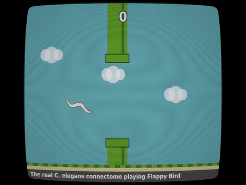
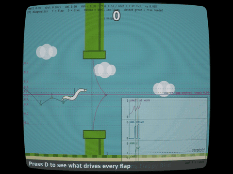
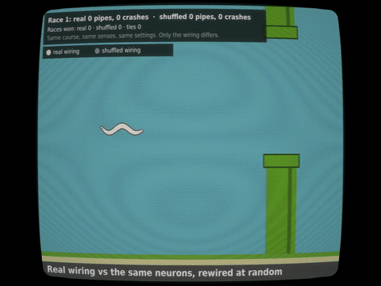

# FlappyWorm

The real 302-neuron wiring diagram of the worm *C. elegans* playing Flappy Bird, and learning to get better as it eats.

**[Play it](index.html)** (one self-contained page; open it in a browser) · press **D** while playing to see what drives every flap.

Full video: [docs/media/flappyworm.mp4](docs/media/flappyworm.mp4)

## What's going on

Each gap in the pipes gives off a food smell. When the worm drifts away from the gap's height, the smell fades. Its odour
neuron **AWC** fires, the signal travels through the real wiring, and the escape neuron **AVA** rises. Each fresh rise of AVA
turns the worm back: a flap if it's sinking, a dive if it's climbing. Passing a gap close to its centre counts as a meal and
strengthens AWC's synapses, so a new worm starts clumsy and learns within its first game.

The brain is a graded rate model of the whole hermaphrodite connectome (Cook et al. 2019, chemical synapses and gap junctions,
via OpenWorm's ConnectomeToolbox), with synapse signs from neurotransmitter identity (Wang et al. 2024) and receptor expression.

Press **D** in the game to watch it happen: smell at the worm, AWC drive, AVA, and the threshold that triggers each turn-back.

## Does the wiring actually matter?

Yes. The controls, all on courses the settings were never tuned on (`validation/results/`):

| Test | Result |
|---|---|
| Learned smell, neural noise on / off | 13.1 / 11.3 of 24 pipes: the smell drives it, not noise |
| Smell switched off | 0 pipes, no turn-backs at all |
| Same neurons, **degree-preserving shuffle** of the wiring (every neuron keeps its connection counts and synapse strengths; only partners change) | 0, 0, 0 (three shuffles) |
| Learning from a modest innate attraction vs synapses frozen | later games mostly 13-24 vs 1-3 |
| Knock out one neuron class at a time (32 games each, Bonferroni-corrected) | only **AIB** significantly hurts: 9.6 vs 19.0 pipes (p < 0.0001); AIY nominal (13.6, p = 0.009); all controls unaffected |

AIB is the published route by which AWC's "odour gone" signal drives reversals (Chalasani et al. 2007). Without it the worm
mostly dies sinking into the bottom pipe: the smell fades but the flap never comes.

There is also a **Real vs shuffled race** mode in the game: two worms, same course, same senses, only the wiring differs.

## What's real and what's engineered

Real: the wiring, transmitter identities, the AWC → AVA pathway, and the learning site (AWC's output synapses).
Engineered, in the same spirit as the 2026 fly connectome demos: the gap's smell, reading a fresh rise of AVA as
"turn back" (threshold set from measured noise, which never reaches it), flap/dive physics, and a 2.5x time stretch: classic
Flappy physics with the game clock running 2.5x slower than the worm's nervous system, because a worm's reflex takes about
half a second. The page's "What's real here?" panel says the same. This is a toy model driven by a real wiring diagram, not an
upload of a worm.

## Run it yourself

    python3 tools/build_flappy.py            # -> build/flappy_worm.html (same as index.html)
    node validation/validate.mjs              # held-out play, noise on/off, smell off, shuffles, learning (~5 min)
    node validation/knockouts.mjs             # 12 conditions x 32 games (~15 min), then:
    python3 validation/knockout_stats.py

Rebuild the brain from OpenWorm's data (optional; `data/brain_v2.json` is included):

    pip install -r requirements.txt
    python3 prep/export.py                    # connectome + signs via ConnectomeToolbox -> data/connectome_cook2019_herm.json
    python3 prep/export_brain.py data/params_v2.json data/brain_v2.json

Promo video (frame-by-frame capture, so it's smooth on any machine): `tools/record_frames.py` then `tools/encode_video.sh`.
`tools/crt/mono-amber-800x600.cfg` is an amber preset for [FFmpeg-CRT-transform](https://github.com/viler-int10h/FFmpeg-CRT-transform)
adapted for 800x600 square-pixel input.

## Data and credits

Wiring: Cook et al. 2019, *Nature*. Transmitter identity: Wang et al. 2024, *eLife*. Receptor expression: CeNGEN via
WormNeuroAtlas. All loaded through [OpenWorm](https://openworm.org)'s ConnectomeToolbox. See `data/DATA_LICENSES.md`.
